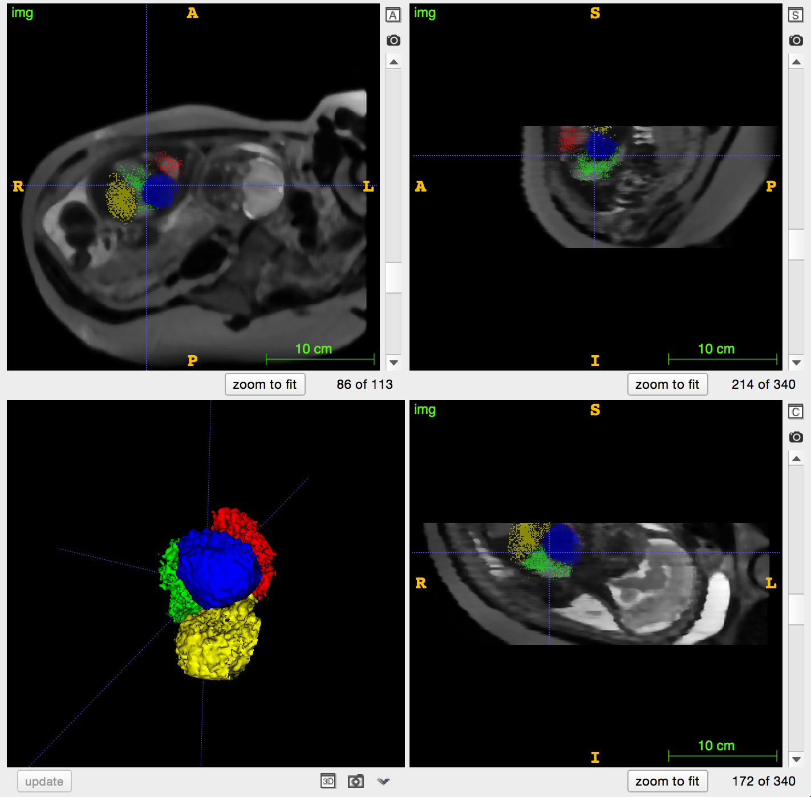

Automated Organ Localisation in Fetal Magnetic Resonance Imaging
================================================================

Code developed throughout my PhD in order to automatically find the organs of a fetus in MR images:

 - **brain-detector** [1,2]
 - **body-detector** [3]
 - **commonlib** contains code used in both projects, in particular fetal biometric measurements in `commonlib/fetal_anatomy.py`
 - **external** contains code that is not used in [1,2,3] but is relevant to automated detection in fetal MRI, 
 such as the RIF features used in [4] 

This code is based on <a href="https://github.com/BioMedIA/python-irtk">python-irtk</a>, a Python interface to IRTK, which can be installed through `conda`:

    conda install -c kevin-keraudren python-irtk

It uses OpenCV version 2 (note that SIFT features are not included by default in OpenCV 3 binaries).

Compiling the code
------------------

    cd body-detector && make

Running the demo
----------------

    cd body-detector && ./demo.sh

Below is a screenshot of the detection results (`detection_results/stack-1/prediction_2/final_seg.nii.gz`):      

  

A demo focusing on the brain detection is available in the repository [example-motion-correction](https://github.com/kevin-keraudren/example-motion-correction).

References
----------

[1] Keraudren, K.,  Kyriakopoulou, V., Rutherford, M., Hajnal, J.V., &
Rueckert, D.: 
<i>Localisation of the Brain in Fetal MRI Using Bundled SIFT
Features</i>. MICCAI 2013.      
<a href="http://www.doc.ic.ac.uk/~kpk09/publications/MICCAI-2013.pdf">PDF</a> 
<a href="https://youtu.be/WdGEb7snJak">video</a>
  <a href="http://www.doc.ic.ac.uk/~kpk09/publications/MICCAI-2013_poster.pdf">poster</a>

[2] Keraudren, K., Kuklisova-Murgasova, M., Kyriakopoulou, V., Malamateniou, C.,
Rutherford, M.A., Kainz, B., Hajnal, J.V., & Rueckert, D.: 
<i>Automated Fetal Brain Segmentation from 2D MRI Slices for Motion Correction</i>.
NeuroImage, 2014.      
  <a href="http://www.doc.ic.ac.uk/~kpk09/publications/NeuroImage-2014.pdf">PDF</a>
  <a href="https://github.com/kevin-keraudren/example-motion-correction">demo</a>
  <a href="https://fr.slideshare.net/kevinkeraudren/presentation-31815788">slides</a>

[3] Keraudren, K., Kainz, B., Oktay, O., Kyriakopoulou, V., Rutherford,
M., Hajnal, J. V., & Rueckert, D.: 
<i>Automated Localization of Fetal Organs
in MRI Using Random Forests with Steerable Features</i>. MICCAI 2015.      
<a href="http://www.doc.ic.ac.uk/~kpk09/publications/MICCAI-2015.pdf">PDF</a>
  <a href="https://youtu.be/LUK3NpPNe0k">video</a>
  <a href="http://www.slideshare.net/kevinkeraudren/pydata-london-2015">slides</a>
  
[4] Kainz, B., Keraudren, K., Kyriakopoulou, V., Rutherford, M., Hajnal, J.,
& Rueckert, D.: <i>"Fast Fully Automatic Brain Detection in Fetal MRI
Using Dense Rotation Invariant Image Descriptors"</i>. ISBI 2014.     
<a href="http://www.doc.ic.ac.uk/~kpk09/publications/ISBI_Kainz2014.pdf">PDF</a>
<a href="https://youtu.be/Xhu4k5-R6FM">video</a>
